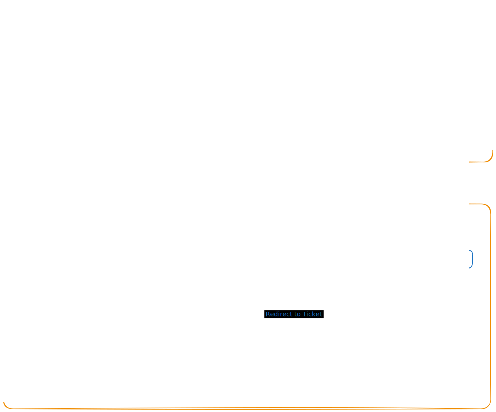

# Homework 00
## Design

## Список сервисов на стороне UberPopug
1. Сервис аутентификации и авторизации (SSO/Intranet)

## Список сервисов на стороне Task Tracker
1. Backend for Frontend.
    - Что делает: Раздаёт фронтенд, статику, проксирует запросы в бэкенд.
    - Обоснование: Нужны были микросервисы, вот и добавил. На старте монолита было бы достаточно.
2. Backend.
    - Что делает: Здесь вся логика работы приложения.
    - Обоснование: Без логики никуда.
3. Database.
    - Что делает: Хранилище всех тасок, профилей и вообще всего.
    - Обоснование: Без хранилища тоже никуда. Реляционные базы one love.

## Коммуникация между сервисами
1. Синхронная
