# Homework 01
## Design
### Domains

| Domain Name | Models                 | Services        |
| ----------- | ---------------------- | -------------   |
| Auth        | Users                  | Web, DB         |
| TaskTracker | Tasks                  | Web, Worker, DB |
| Accounting  | Transactions, Balance  | Web, Cron, DB   |
| Analytics   | StatTasks, StatBalance | Web, DB         |
| Mailing     |                        | Web             |

### Events

| Event                       | Producer    | Consumer   |
|-----------------------------|-------------|------------|
| Task Created or Updated     | TaskTracker | Analytics  |
| Task Assigned or Closed     | TaskTracker | Accounting |
| Balance Updated             | Accounting  | Analytics  |
| User Payed                  | Accountinf  | Mailing    |
| User Daily Report Generated | Accounting  | Mailing    |

### Model
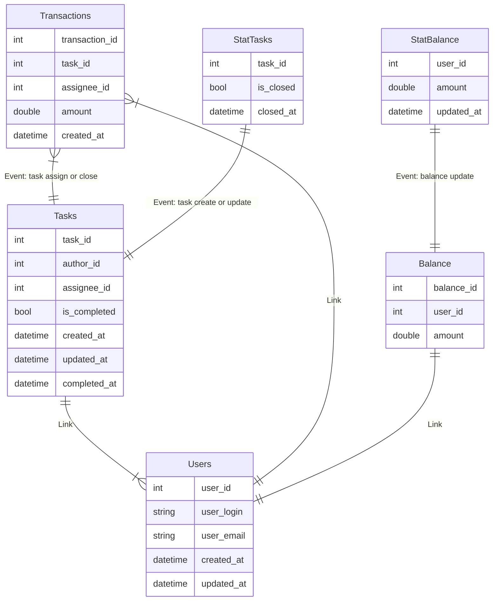
```mermaid
erDiagram
	Users {
		int user_id
		string user_login
		string user_email
		datetime created_at
		datetime updated_at
	}
	Tasks {
		int task_id
		int author_id
		int assignee_id
		bool is_completed
		datetime created_at
		datetime updated_at
		datetime completed_at
	}
	Tasks ||--|{ Users : Link
	Transactions {
		int transaction_id
		int task_id
		int assignee_id
		double amount
		datetime created_at
	}
	Transactions }|--|| Tasks : "Event: task assign or close"
	Transactions }|--|| Users : Link
	Balance {
		int balance_id
		int user_id
		double amount
	}
	Balance ||--|| Users : Link
	StatTasks {
		int task_id
		bool is_closed
		datetime closed_at
	}
	StatTasks ||--|| Tasks : "Event: task create or update"
	StatBalance {
		int user_id
		double amount
		datetime updated_at
	}
	StatBalance ||--|| Balance: "Event: balance update"
```
### Features
#### TaskTracker

**Description:** Таск-трекер должен быть отдельным дашбордом и доступен всем сотрудникам компании UberPopug Inc.

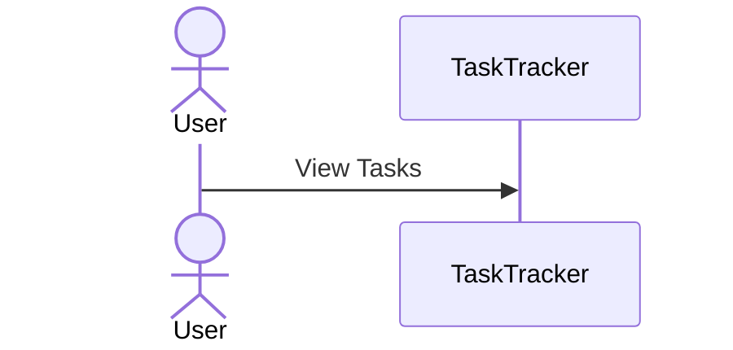
```mermaid
sequenceDiagram
Actor User
Participant TaskTracker
User->>TaskTracker: View Tasks
```

**Description:** Авторизация в таск-трекере должна выполняться через общий сервис авторизации UberPopug Inc (у нас там инновационная система авторизации на основе формы клюва).

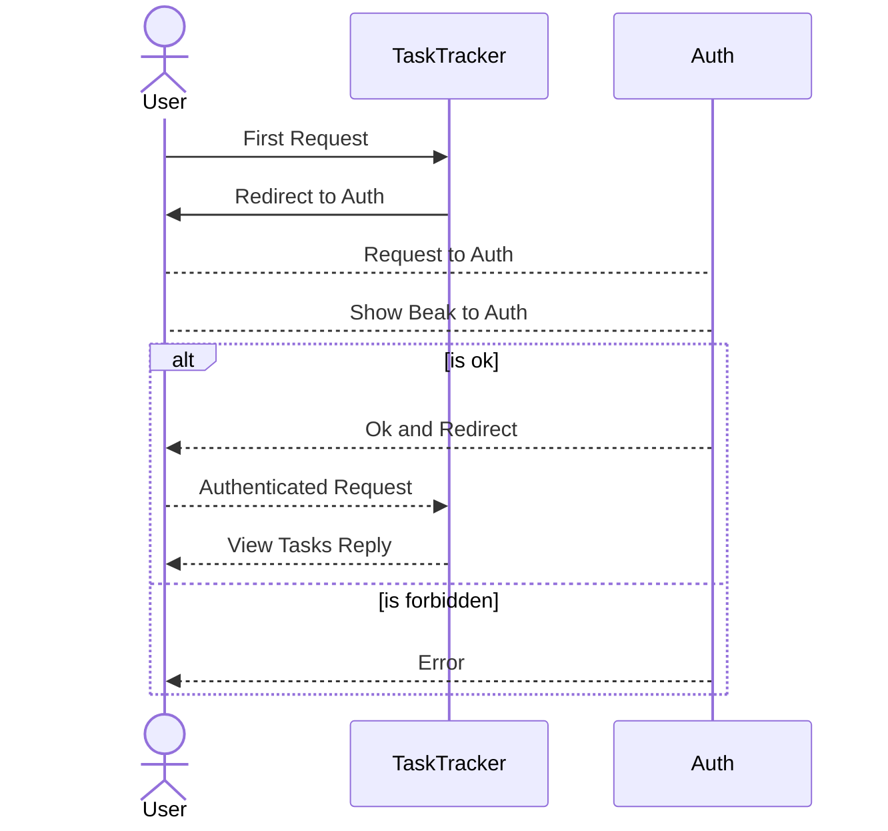
```mermaid
sequenceDiagram
Actor User
Participant TaskTracker
Participant Auth

User->>TaskTracker: First Request
TaskTracker->>User: Redirect to Auth

User-->Auth: Request to Auth
Auth-->User: Show Beak to Auth
alt is ok
	Auth-->>User: Ok and Redirect
	User-->>TaskTracker: Authenticated Request
	TaskTracker-->>User: View Tasks Reply
else is forbidden
	Auth-->>User: Error
end
```

**Description:** Новые таски может создавать кто угодно (администратор, начальник, разработчик, менеджер и любая другая роль). У задачи должны быть описание, статус (выполнена или нет) и рандомно выбранный попуг (кроме менеджера и администратора), на которого заассайнена задача.

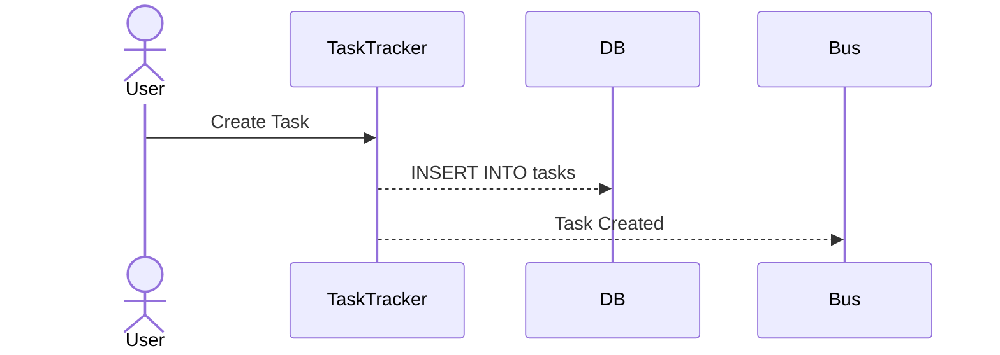
```mermaid
sequenceDiagram
Actor User
Participant TaskTracker
Participant DB
Participant Bus

User ->> TaskTracker: Create Task
TaskTracker -->> DB: INSERT INTO tasks
TaskTracker -->> Bus: Task Created
```

**Description:** Менеджеры или администраторы должны иметь кнопку «заассайнить задачи», которая возьмёт все открытые задачи и рандомно заассайнит каждую на любого из сотрудников (кроме менеджера и администратора) . Не успел закрыть задачу до реассайна — сорян, делай следующую.

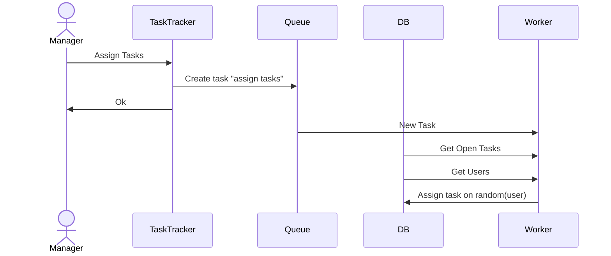
```mermaid
sequenceDiagram
Actor Manager
Participant TaskTracker
Participant Queue
Participant DB
Participant Worker

Manager->>TaskTracker: Assign Tasks
TaskTracker->>Queue: Create task "assign tasks"
TaskTracker->>Manager: Ok
Queue->>Worker: New Task
DB->>Worker: Get Open Tasks
DB->>Worker: Get Users
Worker->>DB: Assign task on random(user)
```

**Description:** Каждый сотрудник должен иметь возможность видеть в отдельном месте список заассайненных на него задач + отметить задачу выполненной.

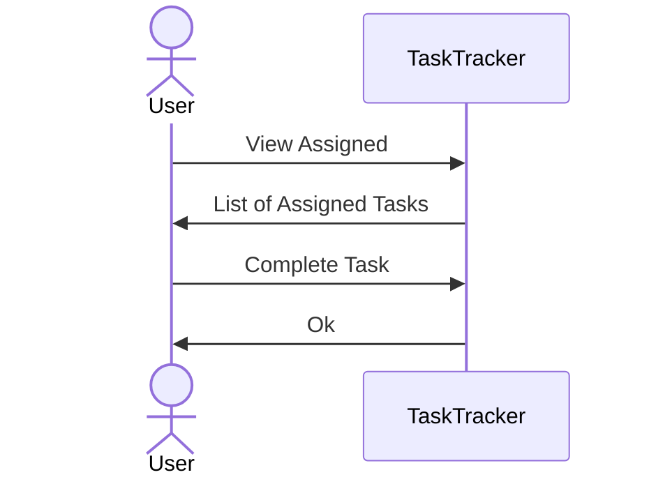
```mermaid
sequenceDiagram
Actor User
Participant TaskTracker

User->>TaskTracker: View Assigned
TaskTracker->>User: List of Assigned Tasks
User->>TaskTracker: Complete Task
TaskTracker->>User: Ok
```

#### Аккаунтинг

**Description:**
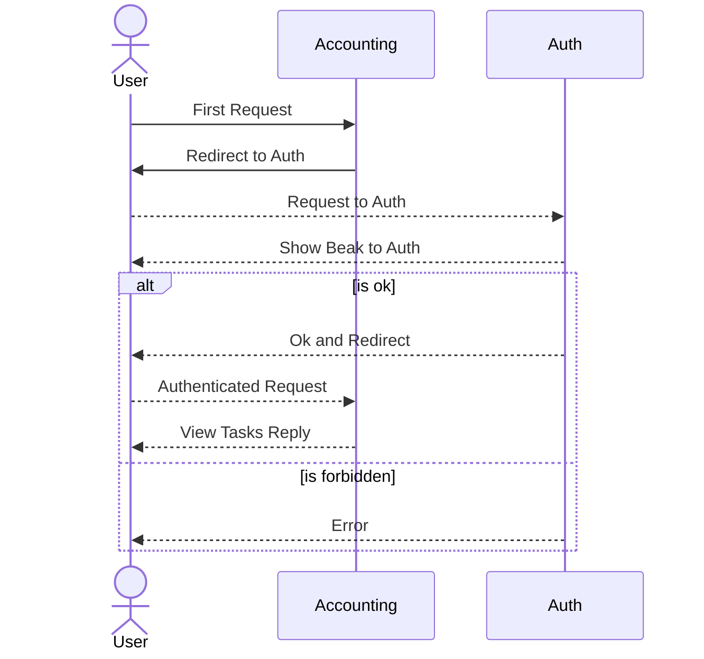
```mermaid
sequenceDiagram
Actor User
Participant Accounting
Participant Auth

User->>Accounting: First Request
Accounting->>User: Redirect to Auth

User-->>Auth: Request to Auth
Auth-->>User: Show Beak to Auth
alt is ok
	Auth-->>User: Ok and Redirect
	User-->>Accounting: Authenticated Request
	Accounting-->>User: View Tasks Reply
else is forbidden
	Auth-->>User: Error
end
```

**Description:** Аккаунтинг должен быть в отдельном дашборде и доступным только для администраторов и бухгалтеров.
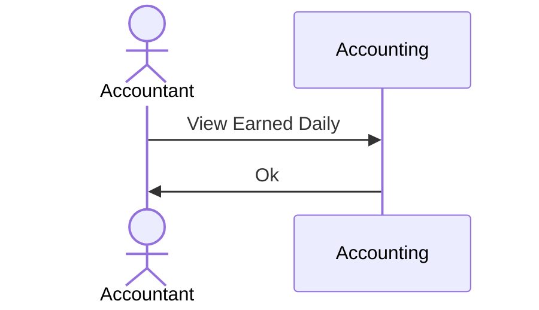
```mermaid
sequenceDiagram
Actor Accountant
Participant Accounting

Accountant->>Accounting: View Earned Daily
Accounting->>Accountant: Ok
```

**Description:** Аккаунтинг должен быть в отдельном дашборде, в котором есть аналитика доступная пользователю.
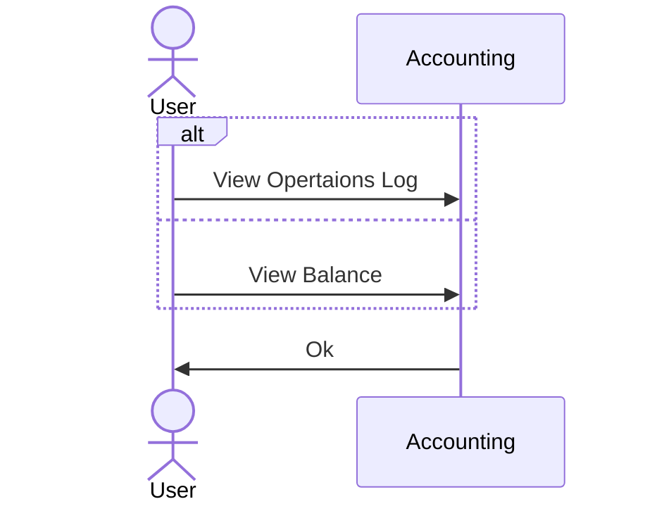
```mermaid
sequenceDiagram
Actor User
Participant Accounting

alt
	User->>Accounting: View Opertaions Log
else
	User->>Accounting: View Balance
end
Accounting->>User: Ok
```

**Description**: У каждого из сотрудников, при регистрации в системе, должен быть свой счёт.

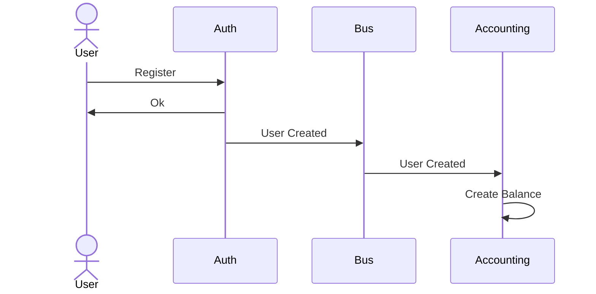
```mermaid
sequenceDiagram
Actor User
Participant Auth
Participant Bus
Participant Accounting

User->>Auth: Register
Auth->>User: Ok
Auth->>Bus: User Created
Bus->>Accounting: User Created
Accounting->>Accounting: Create Balance
```

**Description**: Счёт показывает, сколько за сегодня он получил денег.

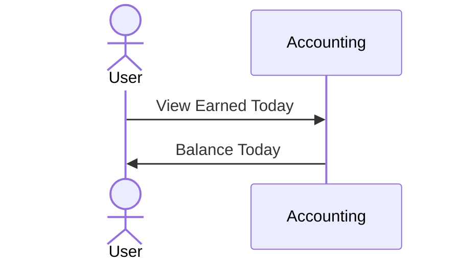
```mermaid
sequenceDiagram
Actor User
Participant Accounting

User->>Accounting: View Earned Today
Accounting->>User: Balance Today
```

**Description**: У счёта должен быть лог того, за что были списаны или начислены деньги, с подробным описанием каждой из операций.

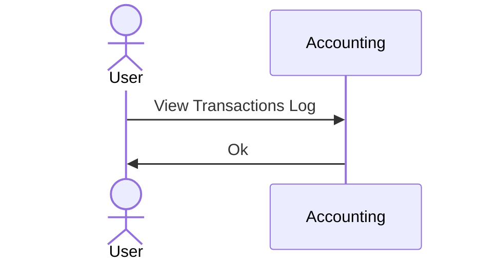
```mermaid
sequenceDiagram
Actor User
Participant Accounting

User->>Accounting: View Transactions Log
Accounting->>User: Ok
```

**Description:** цены на задачу определяется единоразово, в момент появления в системе (можно с минимальной задержкой)

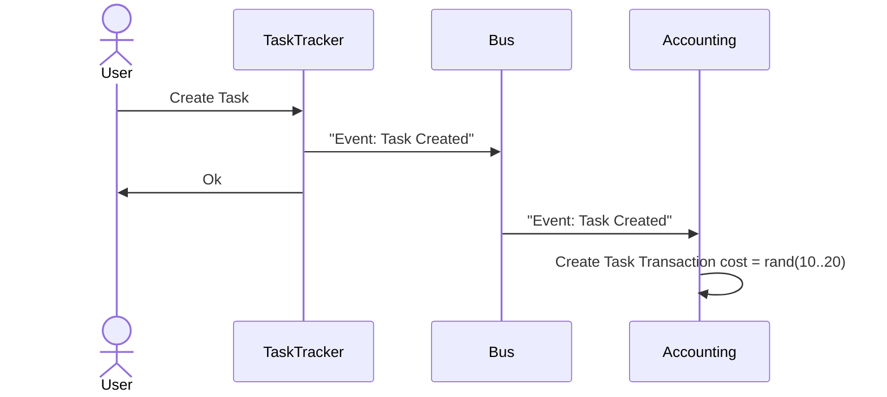
```mermaid
sequenceDiagram
Actor User
Participant TaskTracker
Participant Bus
Participant Accounting

User->>TaskTracker: Create Task
TaskTracker->>Bus: "Event: Task Created"
TaskTracker->>User: Ok

Bus->>Accounting: "Event: Task Created"
Accounting->>Accounting: Create Task Transaction cost = rand(10..20)
```

**Description:** формула, которая говорит сколько начислить денег сотруднику для выполненой задачи — `rand(20..40)$`

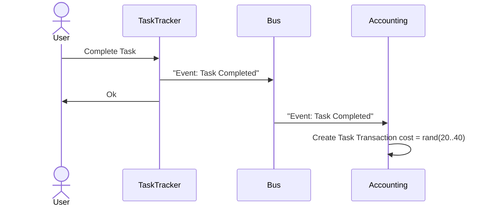
```mermaid
sequenceDiagram
Actor User
Participant TaskTracker
Participant Bus
Participant Accounting

User->>TaskTracker: Complete Task
TaskTracker->>Bus: "Event: Task Completed"
TaskTracker->>User: Ok
Bus->>Accounting: "Event: Task Completed"
Accounting->>Accounting: Create Task Transaction cost = rand(20..40)
```

**Description:** Дашборд должен выводить количество заработанных топ-менеджментом за сегодня денег т.е. сумма заасайненых задач минус сумма всех закрытых задач за день: `sum(assigned task fee) - sum(completed task amount)`

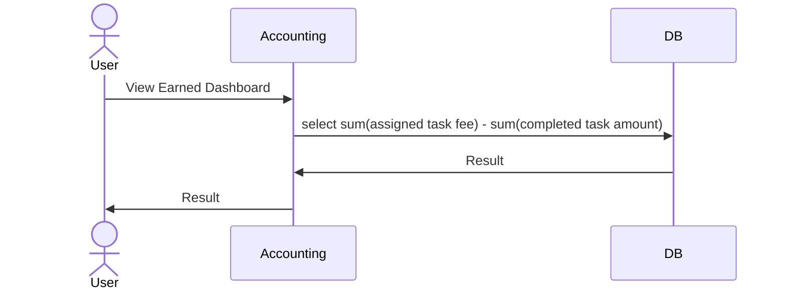
```mermaid
sequenceDiagram
Actor User
Participant Accounting
Participant DB

User->>Accounting: View Earned Dashboard
Accounting->>DB: select sum(assigned task fee) - sum(completed task amount)
DB->>Accounting: Result
Accounting->>User: Result
```

**Description**: После выплаты баланса (в конце дня) он должен обнуляться, и в аудитлоге всех операций аккаунтинга должно быть отображено, что была выплачена сумма.

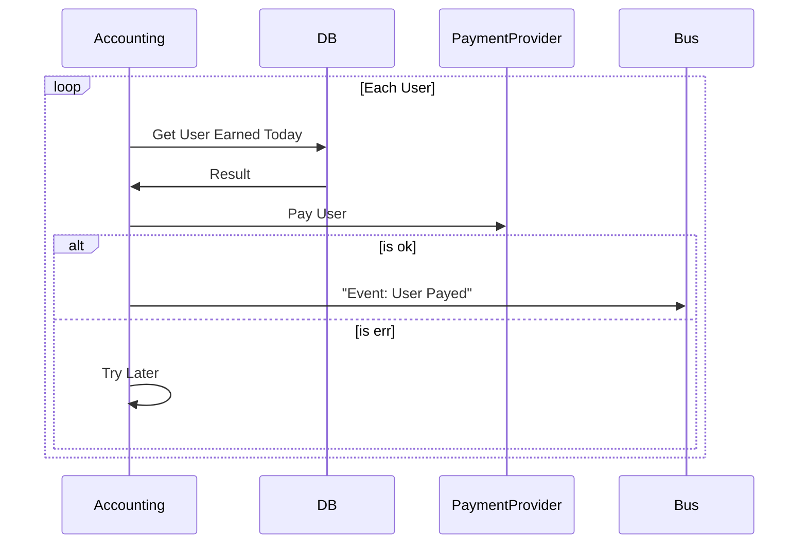
```mermaid
sequenceDiagram
Participant Accounting
Participant DB
Participant PaymentProvider
Participant Bus

loop Each User
	Accounting->>DB: Get User Earned Today
	DB->>Accounting: Result
	Accounting->>PaymentProvider: Pay User

	alt is ok
		Accounting->>Bus: "Event: User Payed"
	else is err
		Accounting->>Accounting: Try Later
	end
end
```

**Description:** В конце дня необходимо считать сколько денег сотрудник получил за рабочий день и отправлять на почту сумму выплаты.

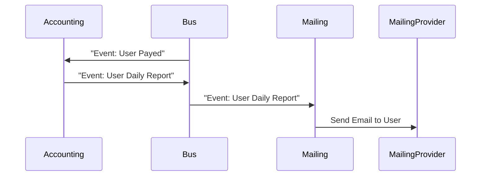
```mermaid
sequenceDiagram
Participant Accounting
Participant Bus
Participant Mailing
Participant MailingProvider

Bus->>Accounting: "Event: User Payed"
Accounting->>Bus: "Event: User Daily Report"

Bus->>Mailing: "Event: User Daily Report"
Mailing->>MailingProvider: Send Email to User
```

**Description**: Дашборд должен выводить информацию по дням, а не за весь период сразу.

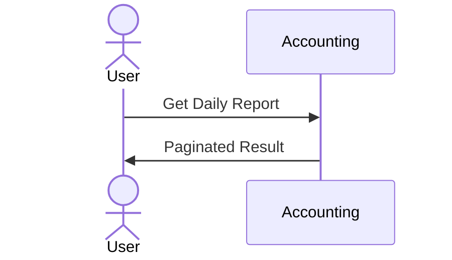
```mermaid
sequenceDiagram
Actor User
Participant Accounting

User->>Accounting: Get Daily Report
Accounting->>User: Paginated Result
```

#### Аналитика

**Description**: Аналитика — это отдельный дашборд, доступный только админам. 
- Нужно указывать, сколько заработал топ-менеджмент за сегодня и сколько попугов ушло в минус.
- Нужно показывать самую дорогую задачу за день, неделю или месяц.

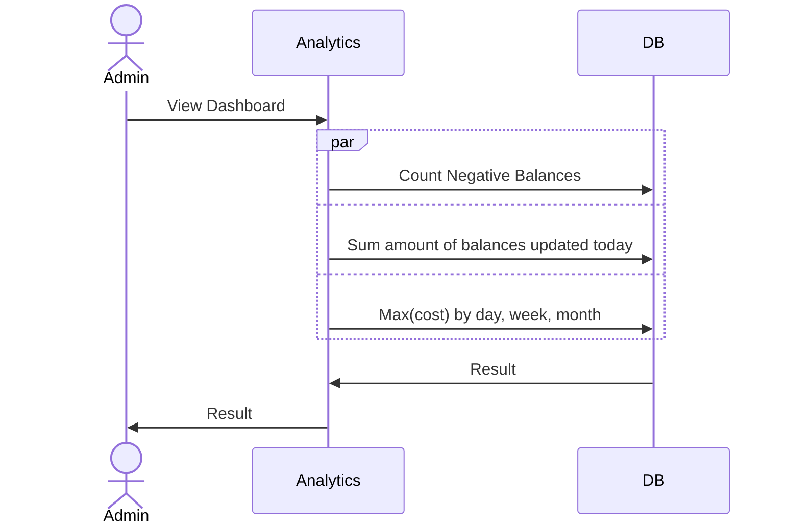
```mermaid
sequenceDiagram
Actor Admin
Participant Analytics
Participant DB

Admin->>Analytics: View Dashboard
par
	Analytics->>DB: Count Negative Balances
and
	Analytics->>DB: Sum amount of balances updated today
and
	Analytics->>DB: Max(cost) by day, week, month
end

DB->>Analytics: Result
Analytics->>Admin: Result
```

